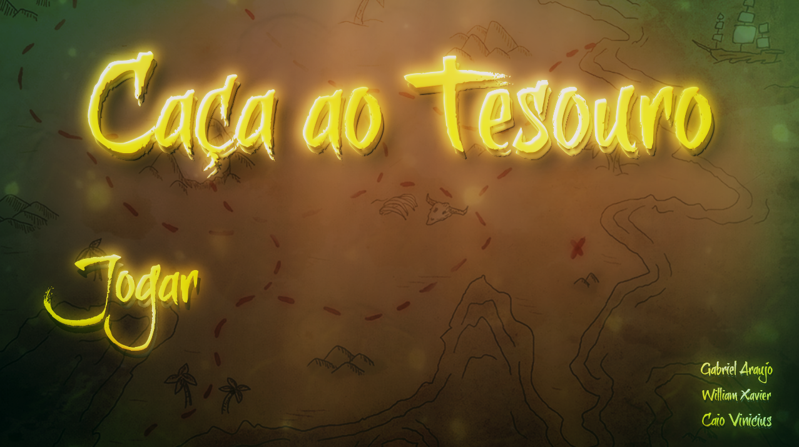
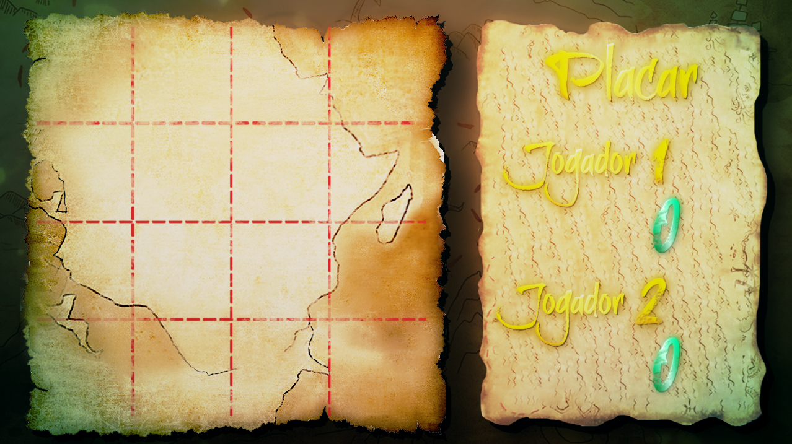
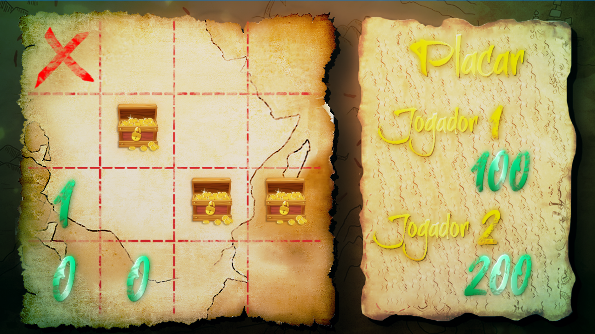
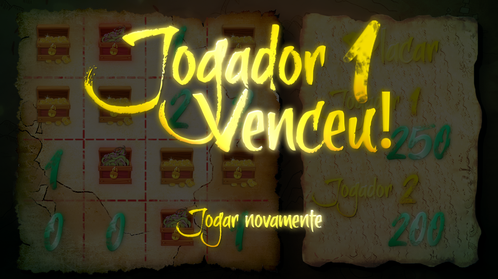

# The Treasure Hunt!

Hey everyone! My first college end-of-semester final project consisted in creating a game similar to minefield games.

### Here's what my team got up with - Treasure Hunt!

## Game Experience

### Treasure Hunt is a 1v1 turn-based minefield-like game.

You are supposed to find as many treasure chests as possible, each one of them increase your score by 100 points, but beware of the kraken chests, they reduce your score by 50 points!

### When you click on a cell, it's revealed what's underneath it. Numbers indicate how many **treasure** chests are around that cell in a *+* direction, use that information to guide your playthrough.

### At the end, when all cells are revealed, the player with the highest score wins!

## Animations

All Treasure Hunt's assets animation were developed by manipulating stock images with the use of Adobe Photoshop and After effects.

## Libraries used

* Pygame
* Moviepy
* Random

# Our team!

### Gabriel Araújo - Data Science and Artificial Intelligence student at Universidade Federal da Paraíba - UFPB
* Github profile: https://github.com/gabriellst

### William Xavier - Data Science and Artificial Intelligence student at Universidade Federal da Paraíba - UFPB
* Github profile: https://github.com/WilliamXnl

### Caio Vinícius - Data Science and Analytics student at the University of Calgary
* Github profile: https://github.com/Caioviniciusb
