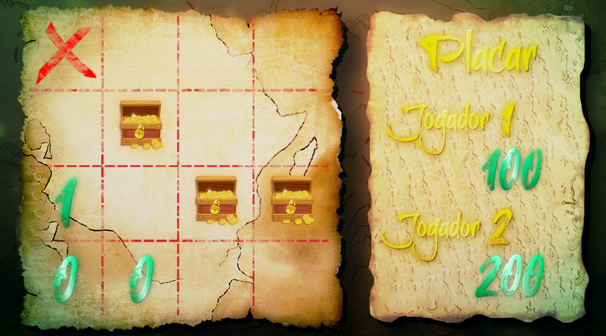

# The Treasure Hunt!

Hey everyone, my first semester's final project consisted of creating a game similar to minefield games.

All Treasure Hunt's captions are in portuguese.

### Here's what my team got up with.

## Game Experience

### Treasure Hunt is a 1v1 turn based minefield-like game.

You and your opponent are supposed to find as many treasure chests as possible, each one of them increase your score by 100 points, but beware of the kraken chests, they reduce your score by 50 points!

### Each cell number indicates how many **treasure** chests are around them in a *+* direction, use that information to guide your playthrough.

### Animations

All Treasure Hunt's animation and assets were developed by manipulating stock images with the use of Photoshop and After effects.

## Libraries used

* Pygame
* Moviepy
* Random

# Our team!

### Gabriel Araújo - Data Science and Artificial Intelligence student at Universidade Federal da Paraíba - UFPB
* Github profile: https://github.com/gabriellst

### William Xavier - Data Science and Artificial Intelligence student at Universidade Federal da Paraíba - UFPB
* Github profile: https://github.com/WilliamXnl

### Caio Vinícius - Data Science and Analytics student at the University of Calgary
* Github profile: https://github.com/Caioviniciusb

